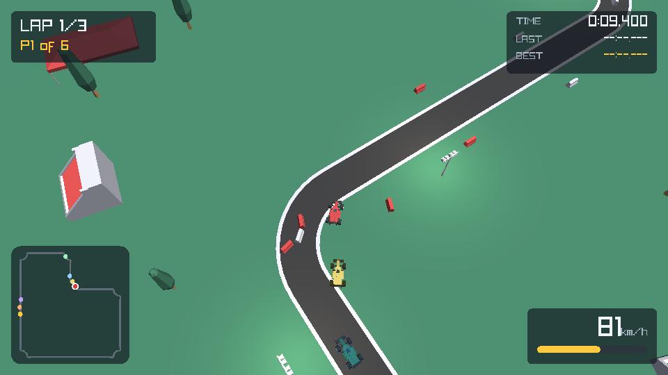
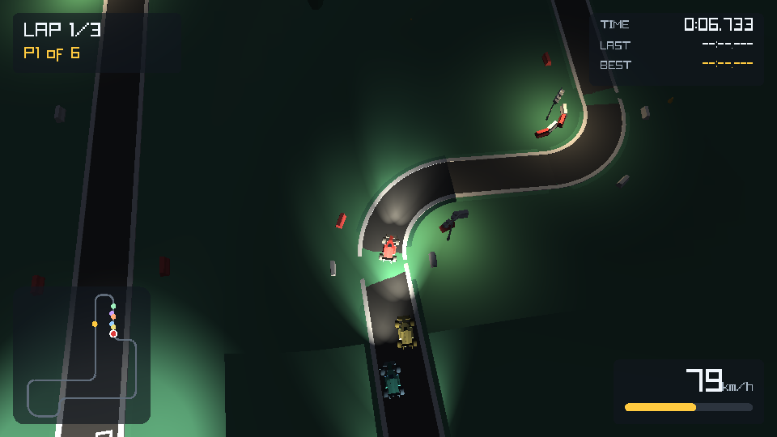

# Kenney Top-Down Racer

A small 3D game engine in C on top of [raylib](https://www.raylib.com/), with
[Blender](https://www.blender.org/) as the level editor and
[Kenney's Racing Kit](https://kenney.nl/assets/racing-kit) (CC0) for art — plus a
top-down arcade racer built with it.

Levels are authored by placing kit pieces in Blender, drawing the racing line as
a curve, and exporting a JSON file the engine loads directly. The same `.glb`
files Blender imports are the ones the engine renders, so the viewport is a
faithful preview.



Press `N` for a night race — the lamp posts come up to full and every car
switches on a pair of spot headlights:



New to the code? [`docs/learn/`](docs/learn/README.md) is a sixteen-chapter walk
through every subsystem — arenas, splines, SAT collision, the vehicle model,
batching, shadow mapping, headless testing — explaining not just what each does
but why it is shaped that way, with exercises.

---

## Quick start

raylib is a git submodule (pinned to its 5.5 tag) and is built from source by
the Makefile, using raylib's own Makefile — no CMake, no zig.

```sh
git clone --recurse-submodules <this repo>
cd ray-blender-test
make                    # builds raylib, then build/desktop/racer
make run                # play
```

Already cloned without submodules? `git submodule update --init` (or
`make submodule`). `tools/setup.sh` does that, names any missing system
packages for your distribution, and fetches the art kit if it is absent.

### Platforms

| | Build | Needs |
|---|---|---|
| **Linux** (Arch, Debian, Fedora…) | `make` | GL, X11, ALSA headers |
| **Windows** | `make` from an **MSYS2 MinGW64** shell | `mingw-w64-x86_64-gcc make git` |
| **Raspberry Pi console** | `make PLATFORM=drm` | libdrm, libgbm, EGL, GLES2 |
| **macOS** | `make` | Xcode command line tools (untested) |

Dependencies, if `setup.sh` reports any missing:

```sh
# Arch
sudo pacman -S --needed base-devel mesa libx11 libxrandr libxi libxcursor \
    libxinerama alsa-lib

# Debian / Ubuntu / Raspberry Pi OS
sudo apt-get install -y --no-install-recommends \
    build-essential libgl1-mesa-dev libx11-dev libxrandr-dev libxi-dev \
    libxcursor-dev libxinerama-dev libxkbcommon-dev libasound2-dev \
    libdrm-dev libgbm-dev libegl1-mesa-dev libgles2-mesa-dev

# Windows, in the MSYS2 MinGW64 shell
pacman -S --needed mingw-w64-x86_64-gcc make git
```

On Windows, build from a shell that provides `sh`, `mkdir -p` and `rm` — an
MSYS2 MinGW64 shell, or Git Bash with a MinGW `gcc` and `make` on PATH. Plain
`cmd.exe` will not work. Toolchains often install to paths with spaces and
brackets (`C:/Program Files (x86)/GnuWin32/bin/make`); the Makefile quotes those
where it needs to, so that is fine.

The desktop and DRM builds each get their own raylib, configured differently
(OpenGL 3.3 vs GLES2) and kept in `build/<platform>/libraylib.a`, so you can
switch between them without a full rebuild. `make clean` removes both along with
raylib's intermediates.

### Controls

| Key | Action | | Key | Action |
|---|---|---|---|---|
| `W` / `↑` | Throttle | | `P` | Pause |
| `S` / `↓` | Brake, then reverse | | `R` | Respawn (restart on results) |
| `A` `D` / `←` `→` | Steer | | `C` | Toggle rotating / north-up camera |
| `Space` | Handbrake | | `F1` | Debug overlay |
| `Esc` | Quit | | `F2` | Screenshot |
| | | | `N` | Toggle day / night |

A gamepad works too: left stick steers, triggers drive and brake.

### Command line

```
--level PATH        level to load (default levels/circuit01.level.json)
--racers N          field size, 1..8
--width/--height N  window size
--fullscreen        borderless fullscreen
--no-audio          skip the audio device
--autopilot         let the AI drive the player's car (attract mode)
--night             start at night, lamp posts and headlights lighting the scene
--debug             start with the debug overlay
--frames N          quit after N frames
--shots a,b,c       screenshot on those frames, with --shot-prefix
--shot-every N      screenshot every Nth frame, to assemble into a video
```

---

## Running on a Raspberry Pi console

raylib can render straight to DRM/KMS, so the game runs on a bare TTY with GPU
acceleration and no X server:

```sh
make PLATFORM=drm
./build/drm/racer
```

This needs a display connected — it opens `/dev/dri/card0` directly and will
report `No suitable DRM connector found` on a headless machine. Run it from the
console rather than over SSH, or the process cannot become DRM master. The
desktop build is the one to use inside a normal X or Wayland session.

> The DRM target compiles, links and initialises GLES2 here, but it has **not**
> been run against a real panel in this repository's development environment
> (no monitor attached). The desktop path is fully exercised.

---

## Layout

```
engine/          reusable, game-agnostic
  arena.*        bump allocator: a level is one allocation, freed in one call
  json.*         dependency-free JSON reader used by the level loader
  level.*        level file -> props, colliders, sand traps, spawns, waypoints,
                 checkpoints
  spline.*       closed centre line: arc length, nearest point, width, gradient
  collide.*      oriented boxes on XZ, SAT, uniform-grid broadphase
  light.*        point and spot lights, per-draw relevance selection
  terrain.*      heightfield ground fitted to the racing line
  render.*       static batching, frustum culling, lighting shader, chase camera
  assets.*       name-keyed model/texture/sound cache
  audio.*        procedurally synthesised engine note, tyre scrub, beeps
  input.*        keyboard + gamepad mapped onto actions
  core.*         window, subsystems, fixed-timestep helper

game/            the racer itself
  car.*          arcade vehicle physics with drift
  ai.*           racing-line follower with corner speed and car avoidance
  race.*         grid, laps, checkpoints, standings, collision resolution
  hud.*          readouts, minimap, countdown, results
  main.c         wiring and the frame loop

tools/blender/   io_kenney_racing.py   the level-editor add-on
                 build_demo_track.py   generates levels/circuit01
tools/           setup.sh, check_shaders.sh
tests/           headless engine + full-race simulation tests
docs/learn/      a chapter-by-chapter walkthrough of how all of it works
levels/          circuit01.level.json (loaded) + circuit01.blend (editable)
vendor/raylib/   raylib 5.5, a git submodule, built by the Makefile
```

### Design notes

**Static batching.** The kit is untextured flat-shaded geometry, so at load time
every prop is baked into vertex-coloured meshes grouped into spatial chunks. The
demo track's 263 props collapse into a few dozen chunk meshes, of which only the
ones in view pass the frustum test each frame. This matters a lot on a Pi.

**Progress by arc length.** Lap counting uses distance along the centre line, not
geometric gate crossings, so clipping the edge of a checkpoint or being shoved
sideways through one cannot corrupt a lap. Gates are still enforced in order, so
cutting the course does not advance you.

**Drivability from the racing line.** There are no invisible track walls. The
centre line carries a width; inside it you are on tarmac, outside it grip and top
speed drop. Solid objects (barriers, trees, grandstands) are real colliders.

**Run-off.** Corners reached from a long straight have a gravel trap on the
outside, drawn with the kit's sand pieces and felt through a list of boxes in the
level file. Neither is derived from the other — the art is a mesh, the physics is
a region — so the tests are what hold them together: no trap may cover the racing
line, every trap has to be reachable by running wide, and a car dropped into one
flat out has to be walking a second later.

Gravel is deliberately not a slower line through the corner. Top speed falls to
30% and a heavy drag holds full throttle to about 0.95 u/s, a seventh of the pace
on tarmac; you crawl out sideways or the marshals lift you back to the line after
six seconds. Nothing solid is ever placed inside a trap, and the barriers that
would normally hug the track are pushed out behind the gravel, exactly as they
are on a real circuit — a barrier a car reaches before the trap has slowed it
down is just a wall to hit.

**Elevation.** The centre line carries height and gradient. Driving stays a 2D
problem on the XZ plane — collision, steering and lap progress all ignore Y —
but the surface height and slope ride along with every query, so cars sit on the
road, pitch to it, and gain or lose speed on gradients. Arc lengths are measured
on the ground, so a climb does not stretch lap progress or gate spacing.

Gravity along the road is set to about 1.5x the engine's own acceleration. True
gravity at this scale would be nearer 2.4x, which turned the demo circuit's 18%
climbs into a crawl.

**Terrain.** A flat ground plane stops working as soon as a track has hills, so
the ground is a heightfield fitted to the racing line by inverse-distance
weighting — hugging the road, relaxing to the average height in the open, with
normals computed from the field so slopes shade. It is chunked like the static
batch, for culling and so each piece is lit by its own neighbourhood.

**Fixed timestep.** Physics runs at 120 Hz regardless of frame rate.

**Lighting.** One directional key light plus any number of point and spot
lights, forward shaded. A scene can hold up to 64 lights, but only the eight
most relevant to whatever is being drawn are uploaded — chosen per batch chunk,
per car and for the ground plane — so fragment cost is fixed and the uniform
budget stays small enough for GLES2 on the Pi. Lights that cannot reach an
object are skipped entirely, and with no lights in range the loop exits on its
first iteration, so an unlit level costs nothing.

Placed lights are dimmed to 30% during the day and come up to full at night,
which is why the lamp posts read as subtle warm pools in daylight and carry the
scene once you press `N`. Each car also has a pair of spot headlights that
follow its transform; they switch on with night mode.

---

## Authoring a level in Blender

Install `tools/blender/io_kenney_racing.py` via *Edit ▸ Preferences ▸ Add-ons ▸
Install from Disk*, enable **Kenney Racing Kit Level Editor**, and point its
*Kit Models Folder* preference at `assets/models/`. The tools live in the 3D
viewport sidebar (`N`) under the **Racing Kit** tab.

The fastest way in is to open `levels/circuit01.blend` and edit the demo circuit.

1. **Lay track.** Pick a piece from the dropdown and *Add Prefab*. It lands at
   the 3D cursor, snapped to the kit's one-unit grid. *Rotate ⟳ / ⟲* turns pieces
   a quarter turn; *Snap To Kit Grid* re-snaps anything you dragged.
2. **Draw the racing line.** *Add Racing Line* creates a closed Bézier curve —
   edit it to trace the middle of your track. This is what the engine uses for
   lap progress, the AI and the off-track test, so it is required.
3. **Place the grid.** *Add Spawn* once per starting slot. The arrow shows which
   way the car faces; order comes from the `kr_index` custom property.
4. **Add gates** with *Add Checkpoint*, in order, starting with the finish line
   as index 0. If you export none, the engine generates twelve from the racing
   line automatically.
5. **Mark obstacles.** Scenery prefabs (barriers, trees, grandstands…) get
   colliders automatically. *Tag Solid* forces one onto any other object, and
   tagging an object with no prefab turns it into an invisible blocking volume.
6. **Dig run-off.** *Add Sand Trap* drops a cube gizmo; scale and rotate it over
   the gravel and any car that leaves the road inside it bogs down. Only the
   footprint counts, nothing is drawn from it, and nothing about it is solid —
   lay the kit's `roadCorner*Sand` pieces on top for the look. *Validate Level*
   warns if a trap reaches the racing line.
7. **Light it.** *Point Light* / *Spot Light* drop a lamp at the cursor, but any
   Blender lamp exports — including ones you add through Blender's own *Add ▸
   Light* menu. Tune **Power** and **Custom Distance** in the light's data
   properties; a **Sun** lamp becomes the level's key light, taking its
   direction, colour and strength. *Sun* and *Ambient* in the panel set the
   daylight balance.
8. **Check and export.** *Validate Level* reports anything missing; *Export
   Level* writes the JSON. Level name, lap count, track width and colours live in
   the same panel.

Blender measures light power in watts and the engine wants a small unitless
brightness, so the exporter divides Power by 100. A `kr_intensity` custom
property overrides that outright, and `kr_range` overrides the reach.

### Elevation

A straight in `build_demo_track.py` carries a rise, which pitches its tiles about
their own lateral axis and lifts the centre line. Tiles are stretched by
`1/cos(pitch)` so a sloped one still spans a whole grid cell. Corners stay level:
a quarter arc cannot be pitched about a single axis without twisting it, so
gradients live on the straights and the track crests before turning in.

Authoring by hand in Blender, you simply move pieces in Z and let the racing-line
curve follow them — the exporter carries height through on everything.

Rebuild the demo track from scratch with:

```sh
make level      # blender --background --python tools/blender/build_demo_track.py
```

### Coordinate spaces

Blender is Z-up, the engine (like glTF) is Y-up. A Blender point `(x, y, z)`
exports as engine `(x, z, -y)`, and a rotation basis `M` as `C·M·Cᵀ`. Because
imported prefabs have their transforms applied, an object's Blender transform is
exactly what the engine applies to the model.

One wrinkle worth knowing: **kit models do not have their origins at the centre
of their geometry.** Kenney's exporter baked a per-model offset into each glTF
node — road tiles, for instance, put their cell corner a constant `(-0.35,
-0.65)` from the origin. This cannot be fixed by re-centring meshes in Blender,
because the engine loads the original `.glb`; `build_demo_track.py` compensates
at placement time instead (see `place_centred`).

---

## Level format

```jsonc
{
  "format": "kenney-topdown-racer",
  "version": 1,
  "name": "Kenney Circuit 01",
  "settings": {
    "laps": 3,
    "track_width": 0.69,          // drivable width, world units
    "sky_color":     [124, 176, 214, 255],
    "ground_color":  [77, 143, 110, 255],
    "ambient_color": [88, 90, 100, 255],
    "sun_direction": [-0.45, -1.0, -0.35],
    "sun_color":     [255, 250, 235, 255],
    "sun_intensity": 0.62
  },
  "props": [                       // visual only
    { "model": "roadStraight",     // assets/models/<model>.glb
      "pos":   [0, 0, 0],
      "rot":   [0, 90, 0],         // optional, XYZ euler degrees (Rx·Ry·Rz)
      "scale": [1, 1, 1],          // optional
      "tint":  [255, 255, 255, 255] }
  ],
  "colliders": [                   // solid, solved on the XZ plane
    { "pos": [0, 0.06, 0], "half": [0.125, 0.06], "height": 0.13, "yaw": 90 }
  ],
  "sandtraps": [                   // run-off gravel: slow, not solid, no height
    { "pos": [3.7, 0, 12.1], "half": [0.265, 0.296], "yaw": 22.5 }
  ],
  "lights": [                      // point and spot lights
    { "type": "point", "pos": [1.2, 0.72, 8.0],
      "color": [255, 219, 158, 255], "intensity": 2.1, "range": 3.0 },
    { "type": "spot",  "pos": [-1.4, 2.3, 8.5], "dir": [1, -1.5, 0],
      "color": [255, 242, 217, 255], "intensity": 3.4, "range": 5.2,
      "cone": [23.65, 43.0] }      // inner and outer half-angles, degrees
  ],
  "spawns":      [ { "pos": [0.15, 0, 6], "yaw": 0 } ],
  "waypoints":   [ { "pos": [0.15, -1.5, 0], "width": 0.69 } ], // ordered, closed; Y is the
                                                                // surface height and drives
                                                                // gradients and the terrain
  "checkpoints": [ { "pos": [0.15, 0, 8], "yaw": 0, "width": 1.1 } ]
}
```

Only `waypoints` (three or more) is truly required. The loader tolerates missing
fields, warns rather than fails on a format mismatch, and accepts `//` comments
so files can be hand-edited.

---

## Tests

```sh
make test           # add --verbose for telemetry
```

`tests/` covers the JSON reader (including malformed input, deep nesting and
allocator exhaustion), the spline, the collision system, and the terrain height
field — which is checked against a plain transcription of the interpolation it
implements, so the fast version cannot quietly drift from the definition.
`test_race.c` then
loads the real level and **simulates a complete six-car race with no window** —
nothing below the renderer touches OpenGL — asserting that every car finishes,
that lap times are plausible, that the field is not crawling, and that no
collider intrudes on the racing surface. That last check is what caught scenery
being placed on the racing line.

The run-off is tested the same way round: the surfaces are measured against each
other (a second flat out covers 5.6 units of tarmac, 3.4 of grass and 1.1 of
gravel), and then a car is dropped off the road at every trap on every circuit
and has to be down to a walking pace a second later.

Tuning lives in `CarDefaultTuning()` in `game/src/car.c`; `make test` reports lap
times, so it doubles as a tuning loop.

---

## The demo circuit

`levels/circuit01` is Spa-inspired rather than a replica — the kit only has
90-degree corners, so what carries over is the rhythm: a hairpin off the start
line, a plunge into a compression, a long climb out of it, a fast straight along
the top, two chicanes, and big-radius sweepers on the way back down. It runs
about 95 units with 2.25 units of elevation between its lowest and highest
points, and the AI laps it in roughly 23 seconds.

The layout is a list of moves in `TRACK`; the script solves two straight lengths
so the loop closes in plan, spreads any leftover gradient so it closes in
elevation, and then asserts that every centre-line point lands on a placed road
tile.

Gravel goes on the outside of every corner reached from a straight of four tiles
or more — six of the ten corners here, thirteen on the Eifel lap. The kit's
sand piece shares its corner's origin and footprint, so the same placement that
lays the corner wraps the run-off around the right side of it; the boxes the
engine tests against are cut from the same arc, six to a quarter turn.

## Credits

- Art: [Kenney Racing Kit](https://kenney.nl/assets/racing-kit) — CC0, see
  `assets/licenses/`.
- Engine: [raylib](https://www.raylib.com/) by Ramon Santamaria, zlib/libpng.
  Vendored as a git submodule at `vendor/raylib`, pinned to the 5.5 tag and
  built from source — the repository carries no prebuilt binaries.
